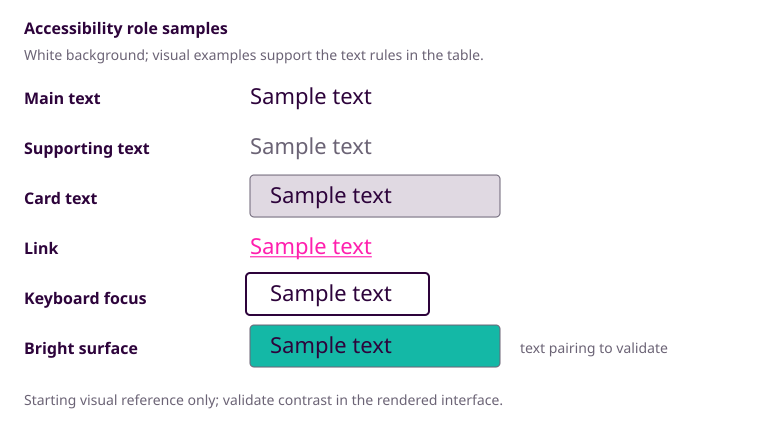

# Visual Direction Brief

## Status

Working brief for the September 10 employment-portfolio MVP. Confirmed decisions and starting values are recorded below; validate them against real content and rendered layouts as the site develops.

## 1. Visual Thesis and Keywords

Create a warm, approachable portfolio that invites curiosity through bright color and thoughtful visual details, while using editorial structure, strong hierarchy, and generous whitespace to keep the work easy to understand. The site should feel distinctive without becoming noisy or difficult to scan.

No single visual reference is required. The design should be developed from the values and constraints in this brief because existing references did not include enough whimsy.

Primary visual values:

- Approachable: make the site feel welcoming, legible, and human.
- Curious: create invitations to explore through detail, variation, and thoughtful visual surprises.
- Warm: use color, tone, and visual softness to make the professional presentation feel personal rather than cold.

Secondary values:

- Polished and professional: maintain credibility for recruiters and technical interviewers.
- Joyful: retain personality and energy without making the experience feel childish or chaotic.
- Scannable: present technical evidence clearly and quickly.
- Accessible: ensure that warmth, whimsy, and color never compromise usability.

Design implication:

- Use quiet editorial-tech structure as the foundation: strong typography, generous whitespace, clear hierarchy, and crisp content groupings.
- Use the bright multi-color palette, friendly details, and small moments of visual surprise to supply warmth, curiosity, and whimsy.
- Keep the foundation calm and the accents intentional rather than making every surface bright or decorative.

Guiding values:

- Live curious: show curiosity, learning, exploration, and thoughtful problem-solving.
- Create with compassion: demonstrate empathy for users and collaborators, including accessibility and practical needs.
- Bring joy: make the experience warm, friendly, approachable, and engaging while remaining professional.

Confirmed keywords: approachable, curious, warm, friendly, compassionate, joyful, polished, professional, scannable, accessible.

## 2. Typography Choices

### Decisions

| Area         | Starting decision                                    |
| ------------ | ---------------------------------------------------- |
| Primary font | `"Trebuchet MS", "Segoe UI", sans-serif`             |
| Use          | Body text and headings                               |
| Font loading | Browser-safe; no external font dependency            |
| Weights      | `400` body, `700` headings and intentional emphasis  |
| Monospace    | Optional decoration for small technical details only |

### Type Scale

| Role            | Size / line height |
| --------------- | ------------------ |
| Body            | `1rem` / `1.6`     |
| Supporting text | `0.875rem` / `1.4` |

### Heading Hierarchy

| Heading | Structural role                      | Size / line height | Weight |
| ------- | ------------------------------------ | -----------------: | -----: |
| `h1`    | Page or primary title                |   `2.5rem` / `1.1` |  `700` |
| `h2`    | Major page section                   |  `1.75rem` / `1.2` |  `700` |
| `h3`    | Subsection or project group          | `1.25rem` / `1.25` |  `700` |
| `h4`    | Minor subsection or supporting group |    `1rem` / `1.25` |  `700` |

### Text Measure

| Content role                            |                Starting measure |
| --------------------------------------- | ------------------------------: |
| Long-form body and project-detail prose |                          `65ch` |
| Hero introduction                       |                          `48ch` |
| About content                           |                   `50ch`-`65ch` |
| Project-card descriptions               | Card width and internal padding |

### Implementation Rules

- Prioritize the shared scale and consistent component rules over one-off adjustments.
- Adjust type scale or measure only when content, wrapping, or readability demonstrates a need.
- Validate typography across desktop, tablet, mobile, and increased browser zoom.

## 3. Neutral Foundation and Accent Colors

Confirmed direction:

- Use a light theme for the MVP.
- Use white (`#ffffff`) for the neutral page background.
- Retain the existing bright, multi-color palette as part of the personal identity.
- Pair the bright palette with restrained neutral foundations so the overall presentation remains calm and scannable.
- Use color to support hierarchy and personality, not to make every surface visually loud.

Starting semantic role map:

| Token              | Current color                                                               | Use                                                                                   |
| ------------------ | --------------------------------------------------------------------------- | ------------------------------------------------------------------------------------- |
| `page-background`  |  `#ffffff`                       | Main page canvas                                                                      |
| `text-primary`     |  `#2d033b`            | Headings, body copy, project descriptions, and other essential content                |
| `text-secondary`   |  `#6b6375` | Metadata, captions, labels, helper text, and other supporting information             |
| `surface-header`   |  `#ffffff`                       | Header background or header emphasis                                                  |
| `surface-footer`   |  `#6366f1`                     | Footer background or deep visual anchor; matches `action-secondary`                   |
| `surface-emphasis` |  `#14b8a6`                         | Featured panels or joyful emphasis                                                    |
| `surface-card`     |  `#e0d9e2` | Project cards; derived as a 15% tint of `text-primary` (`#2d033b`) blended with white |
| `action-primary`   |  `#65a30d`                       | Primary buttons, highest-priority actions, and positive status                        |
| `action-secondary` |  `#6366f1`                     | Supporting buttons and secondary actions                                              |
| `link`             |  `#ff1fae`                         | Text links and navigation links; use a persistent underline                           |
| `focus`            |  `#2d033b`            | Keyboard focus indicator, separate from link color                                    |
| `border-subtle`    |  `#6b6375` | Quiet borders and content separation                                                  |
| `border-emphasis`  |  `#14b8a6`                         | Stronger borders or intentional card accents                                          |

Heading color map:

| Heading | Current color                                                                           |
| ------- | --------------------------------------------------------------------------------------- |
| `h1`    |  `#2d033b` (`text-primary`)       |
| `h2`    |  `#6366f1` (`surface-footer`)              |
| `h3`    |  `#14b8a6` (`surface-emphasis`)                |
| `h4`    |  `#2d033b` (`text-primary`), bold |

## 4. Color Roles and Accessibility Rules

Confirmed rules:

- Maintain readable color contrast.
- Do not rely on color alone to communicate meaning, status, or interaction.
- Preserve visible focus states and clear interactive feedback.
- Keep link identification and keyboard-focus indication visually distinct.
- Use a visible outline, ring, border, or equivalent non-color treatment for keyboard focus.
- Avoid color choices that create problems for colorblind visitors.
- Validate text, controls, links, cards, images, and focus indicators at mobile and desktop sizes.

Provisional pairings:

| Element or role | Starting treatment                                                                                   |
| --------------- | ---------------------------------------------------------------------------------------------------- |
| Main text       | `text-primary`                                                                                       |
| Supporting text | `text-secondary`, only for metadata, captions, labels, helper text, and other supporting information |
| Card text       | `text-primary` on `surface-card`                                                                     |
| Links           | `link` with a persistent underline                                                                   |
| Keyboard focus  | `focus` with a visible `2px` outline and approximately `3px` offset                                  |
| Bright surfaces | Test text pairings independently; do not assume white text is accessible                             |

Visual samples:

Implementation validation:

- Validate `#ff1fae` for normal-sized link text on white and other light surfaces; keep the underline even if the color passes.
- Validate text, controls, borders, focus indicators, and status treatments against their actual backgrounds.
- Give every meaningful image a meaningful alternative text description.
- Add a text label, icon, pattern, border, or other non-color cue whenever color communicates meaning.
- Adjust pairings during implementation when contrast, color perception, or readability requires it.

## 5. Spacing and Layout Rules

Main principle:

> Keep the homepage compact enough for quick evaluation while using whitespace, color, screenshots, and typography to make the experience visually interesting.

Inspiration reference:

- [Ryan Z Wade portfolio](https://ryanzwade.com/): use its straightforward content sequence and simple presentation as inspiration.

Confirmed direction:

- Present the summary blurb, skills, and two compact project cards on the main page.
- Keep each project card focused on the project name, short summary, one screenshot, technical skills used, and links to further details.
- Provide visible email and professional links.
- Maintain clear hierarchy, consistent spacing, and stable layouts across desktop, tablet, and mobile.

Starting layout values:

| Decision              | Starting value                                                               | Why                                                                                               |
| --------------------- | ---------------------------------------------------------------------------- | ------------------------------------------------------------------------------------------------- |
| Maximum content width | `72rem`                                                                      | Gives two cards room to sit together without stretching text too wide.                            |
| Page gutters          | `1rem` mobile, `1.5rem` tablet, `2rem` desktop                               | Protects content from screen edges with one predictable responsive rule.                          |
| Shared spacing rhythm | `0.75rem`, `1.5rem`, `4rem`, `6rem`                                          | Creates consistent relationships between details, components, sections, and major page areas.     |
| First-screen height   | Content-driven; no fixed hero height                                         | Keeps the summary and relevant work visible without a large image pushing content below the fold. |
| Summary composition   | Compact professional summary, skills preview, and early resume/action access | Lets visitors understand who you are and what you offer during a quick scan.                      |
| Project-card grid     | One column below `48rem`; two columns at `48rem` and above                   | Keeps two projects comparable on larger screens and readable on narrow screens.                   |

Validate these starting values during implementation and adjust them only when real content, wrapping, or responsive behavior demonstrates a need.

## 6. Component and Surface Treatments

Starting component treatments:

| Decision                   | Starting treatment                                                                                     | Why                                                                                 |
| -------------------------- | ------------------------------------------------------------------------------------------------------ | ----------------------------------------------------------------------------------- |
| Card background            | `surface-card` (`#e0d9e2`)                                                                             | Separates cards from the white page while keeping the palette quiet.                |
| Border                     | `1px solid border-subtle`                                                                              | Gives each card a reliable boundary without relying on the lavender fill alone.     |
| Radius                     | `0.5rem` / `8px`                                                                                       | Adds warmth while keeping the card crisp and restrained.                            |
| Shadow                     | None by default; use only a very soft shadow if needed                                                 | Preserves the editorial feel and avoids a floating-dashboard look.                  |
| Card padding               | Shared spacing rule starting around `1.5rem`                                                           | Creates consistent internal breathing room without one-off tuning.                  |
| Primary action             | `action-primary` for the details action; `action-secondary` for supporting actions                     | Makes the project-details path primary while keeping live/source links independent. |
| Links                      | `link` color with persistent underline                                                                 | Keeps link identity clear and accessible.                                           |
| Technology indicators      | Compact text badges with restrained borders or pale tints                                              | Keeps technical metadata scannable without making every technology visually loud.   |
| Screenshot ratio           | Start around `16:10` or `3:2` in a stable frame                                                        | Shows useful application detail while keeping cards visually consistent.            |
| Screenshot crop            | Preserve the full image where possible; crop only intentionally                                        | Protects screenshots as evidence of the actual work.                                |
| Captions                   | Show only when they add context; always keep meaningful alt text                                       | Avoids duplicate copy while preserving interpretation and accessibility.            |
| Hover state                | Small elevation or border/accent change without dramatic movement                                      | Adds feedback without making cards unstable.                                        |
| Pressed state              | Slight elevation reduction or border adjustment                                                        | Confirms interaction without shifting the layout.                                   |
| Disabled/unavailable state | Clear status label with muted treatment; keep project information accessible                           | Communicates availability without hiding or presenting a broken project.            |
| Focus state                | Follow section 4’s visible focus rule                                                                  | Keeps keyboard behavior consistent across the site.                                 |
| Bright accents             | Use for labels, borders, small rules, and selected actions; keep `surface-card` as the main background | Preserves whimsy without making every card visually loud.                           |

Validate these starting treatments during implementation and adjust them only when real content, contrast, or interaction behavior demonstrates a need.

## 7. Header, Footer, and Mobile Navigation

Starting site-shell treatments:

| Decision          | Starting treatment                                                                                 | Why                                                                                      |
| ----------------- | -------------------------------------------------------------------------------------------------- | ---------------------------------------------------------------------------------------- |
| Header layout     | Compact white header with identity on the left and primary navigation on the right                 | Keeps the site shell useful without competing with the summary or projects.              |
| Header behavior   | Normal document flow; consider sticky behavior only if the finished page is long enough to benefit | Avoids covering content and preserves the simple editorial structure.                    |
| Navigation        | `Home`, `About`, `Projects`, and `Resume`, with resume visually emphasized                         | Supports recruiter scanning and keeps the information architecture direct.               |
| Mobile navigation | Menu button that opens a vertical list of the same links                                           | Preserves the desktop structure without squeezing links into a narrow row.               |
| Footer            | `surface-footer` indigo with email, GitHub, LinkedIn, resume, and a short site note                | Provides a clear final contact point without a contact form.                             |
| Tagline placement | One prominent appearance near the summary or About area; optional subtle footer reuse              | Gives the values emotional visibility without repeating the slogan throughout the shell. |
| Accessibility     | Use section 4’s focus, expanded-state, link, and contrast rules                                    | Keeps site-shell behavior consistent with the rest of the interface.                     |

Validate these starting treatments during implementation and adjust them only when content, responsive behavior, or accessibility demonstrates a need.

## 8. Motion and Interaction Principles

Starting MVP motion treatment:

| Decision         | Starting treatment                                                                      | Why                                                                      |
| ---------------- | --------------------------------------------------------------------------------------- | ------------------------------------------------------------------------ |
| Page-load motion | None beyond the browser’s normal page rendering                                         | Keeps content immediately available and protects the quick-scan goal.    |
| Section reveals  | Defer until layout, content, and navigation are stable                                  | Keeps polish work from competing with MVP structure.                     |
| Transitions      | `150ms`-`200ms` for hover and focus color, border, or shadow changes                    | Adds responsive feedback without making ordinary interaction feel slow.  |
| Layout movement  | Avoid layout-shifting hover and focus effects                                           | Keeps cards, links, and controls stable while people scan or navigate.   |
| Reduced motion   | Disable nonessential transitions and reveal motion for `prefers-reduced-motion: reduce` | Respects visitor preferences and reduces cognitive or vestibular burden. |
| Image movement   | No automatic rotation; change gallery images only after visitor interaction             | Keeps control with the visitor and preserves predictable presentation.   |

Motion principle:

> Use motion to clarify state or add a small amount of warmth, never to delay, distract from, or replace content.

## 9. Boundaries and MVP Priorities

Keep the MVP focused on clear professional presentation, accessible interaction, and two polished project stories. Add visual personality through deliberate color, typography, whitespace, and small details; defer enhancements that do not materially improve the employment portfolio before the deadline.

| Area          | Starting boundary                                                                               | Why                                                           |
| ------------- | ----------------------------------------------------------------------------------------------- | ------------------------------------------------------------- |
| Scope         | Prioritize the two-project employment MVP before additional features                            | Protects the application deadline and keeps the work focused. |
| Deferred work | Defer dark mode, avatar work, CMS features, and a third project unless it is presentation-ready | Keeps optional work from displacing the core portfolio.       |
